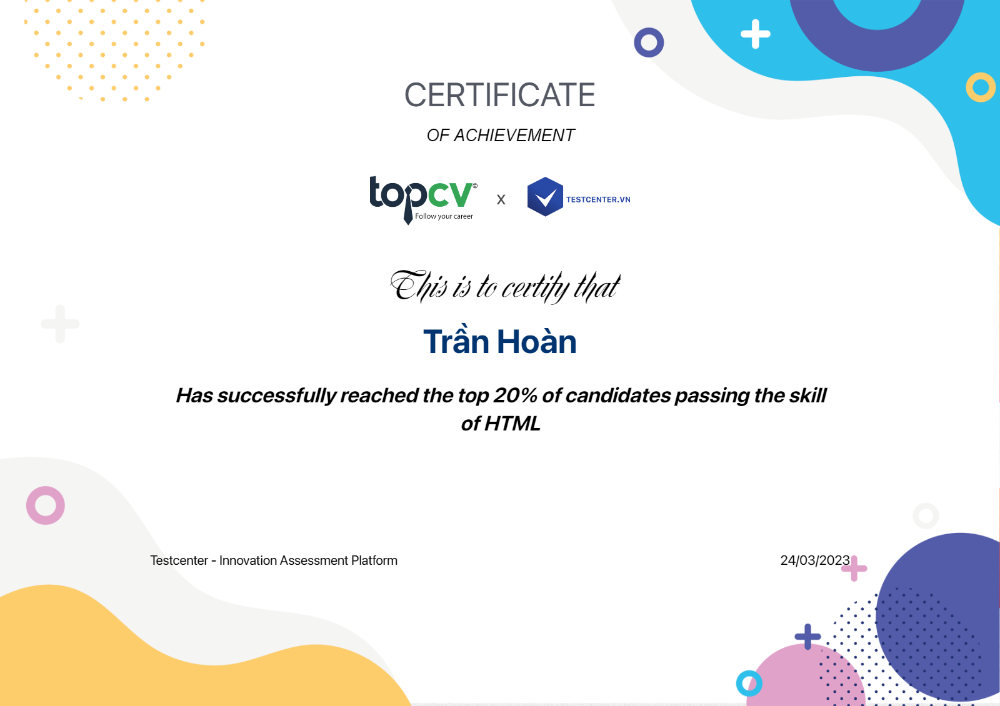
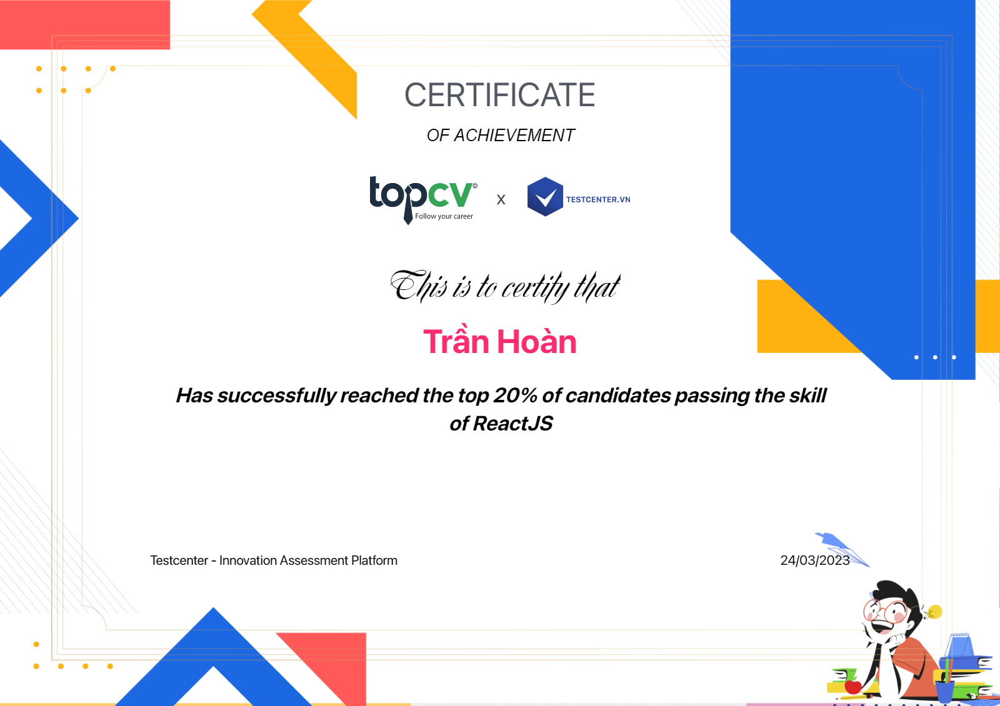
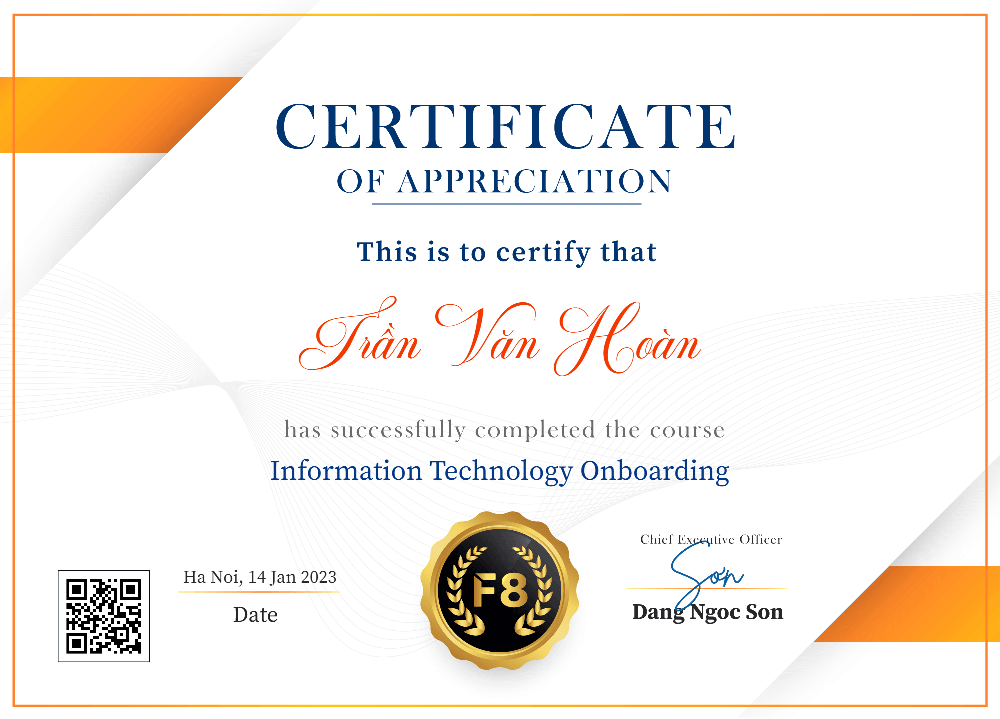

# Hi, I'm Tran Van Hoan 👋
## About me
<table>
<tr>
  <td valign="center">
    🌱 I am currently learning <b>PHP</b>, <b>ReactJs</b> and also interested in <b>Web Development</b>. 
    🎯 My Goal is to Contribute to as many <b>open source project</b> as possible. 
    ✨ I love to create different types of  <b>contents</b>. 
<td >
    
  </td>

</tr>
</table>

## Activity 🖥️

## Connect with me 🤙
<a href="https://www.facebook.com/tranhoan.dz9" target="_blank"></img></a>
<a href="https://www.youtube.com/channel/UCrm7viM-jCm4RaCKYg6-JAQ" target="_blank"></img></a>
<a href="https://www.instagram.com/h.tv.98" target="_blank"></img></a>
<a href="https://www.linkedin.com/in/hoan-tran-van-b5344a1a2/" target="_blank"></img></a>
<a href="https://www.tiktok.com/@vanhoantran508" target="_blank"></img></a>

## Technologies ⚙️
### Languages ✍️
</img>
</img>
</img>
</img>
</img>
</img>

### Devops & Cloud Tools 🛠️
</img>
</img>
</img>
</img>
</img>
</img>
## Stats 📈

 

## Certificate 🎗️

 

<!--START_SECTION:activity-->
<!--END_SECTION:activity-->
## Suprort me 💰
 <a href="https://www.buymeacoffee.com/tranhoandz">
  
</img>
</a>

